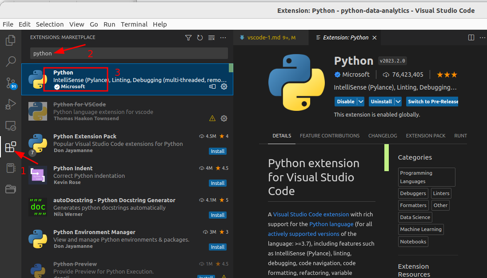

# Install VSCode

## 1 - Install VSCode

From [VS Code page](https://code.visualstudio.com/) download and install VSCode for your platform.

## Setup Python Tools  for VSCode

Install the 'python' extension for VSCode.

Follow the process you see in the screenshot below.

